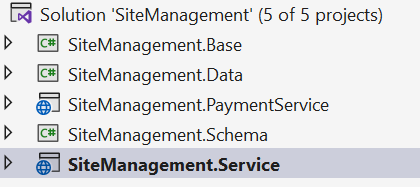
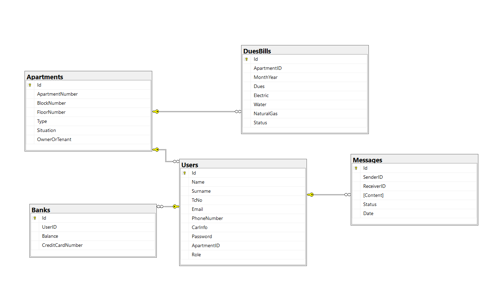
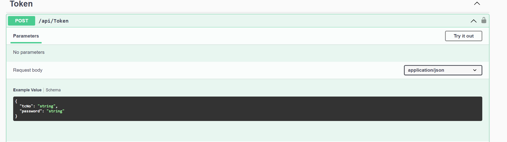
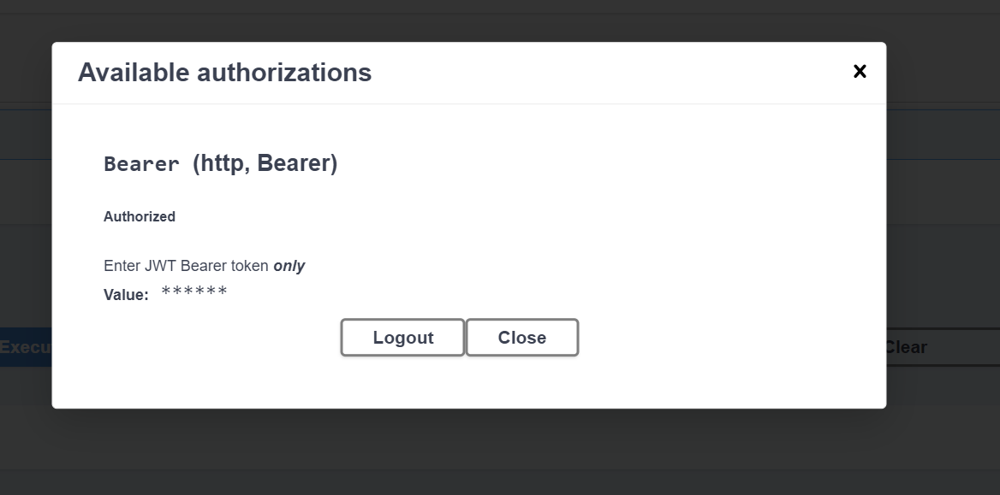

# SiteManagement📝
Bu proje Patika ile gerçekleştirilen Sipay .Net Bootcampinin final case projesidir. 

📫Bizden istenilenlere bir bakalım.
<p>Bir sitede yöneticisiniz. Sitenizde yer alan dairelerin aidat ve ortak kullanım elektrik, su ve doğalgaz faturalarının yönetimini bir sistem üzerinden yapacaksınız. </p>

<p>İki tip kullanıcınız var: </p>

➡️ 1- Admin/Yönetici 

- [x] Daire bilgilerini girebilir. 
- [x] İkamet eden kullanıcı bilgilerini girer. 
- [x] Daire başına ödenmesi gereken aidat ve fatura bilgilerini girer(Aylık olarak). Toplu veya tek tek atama yapılabilir. 
- [x] Gelen ödeme bilgilerini görür. 
- [x] Gelen mesajları görür. 
- [x] Mesajların okunmuş/okunmamış/yeni mesaj olduğu anlaşılmalı. 
- [x] Aylık olarak borç-alacak listesini görür. 
- [x] Kişileri listeler, düzenler, siler. 
- [x] Daire/konut bilgilerini listeler, düzenler siler.

➡️ 2- Kullanıcı 
- [x] Kendisine atanan fatura ve aidat bilgilerini görür.
- [x] Sadece kredi kartı ile ödeme yapabilir. Yöneticiye mesaj gönderebilir.

✍🏻 Sistemin İşleyişi: 
Sistem kullanılmaya başladığında ilk olarak; Yönetici daire bilgilerini girer. Kullanıcı bilgilerini girer.Giriş yapması için otomatik olarak bir şifre oluşturulur.  Kullanıcıları dairelere atar .Ay bazlı olarak aidat bilgilerini girer.Ay bazlı olarak fatura bilgilerini girer .Arayüz dışında kullanıcıların kredi kartı ile ödeme yapabilmesi için ayrı bir servis yazılacaktır. Bu servisde sistemde ki her bir kullanıcı için banka bilgileri(bakiye, kredi kartı no vb.) kontrol edilerek ödeme yapılması sağlanır. 

🛠 Gereksinimler: 
Web projesi için: .Net 
Sistemin yönetimi/database için MS SQL Server / PostgreSQL
Sunum in dokumantasyon (Postman,swagger vs.)  

## PROJE DETAYLARI🌳

✎Öncelikle projemiz bir .Net projesidir .Projede veritabanı olarak MS SQL, dökümantasyon olarak Swagger kullanılmıştır. Generic Repository Pattern uygulanarak daha yönetilebilir bir sitem oluşturulmuştur. Ayrıca projemizde fluent validation ve auto mapper, json web token  da kullanılmıştır.


🎯Projede veri tabanı bağlantı yolunu appsetting.json içerisine yazıyoruz. Bunu yaparak uygulama içerisine bağlantı codelarımızı yazmaktansa daha genel bir yerde kolay bir şekilde yönetilmesini sağlıyoruz. Böylece bir havuzdaki musluklar gibi hangisini istyorsam o musluktan verileri çekmemizi sağlıyor.Daha sonra startup dosyamızıda bağlantımızı mutlaka ekliyoruz.

```c#
  "AllowedHosts": "*",
  "ConnectionStrings": {
    "DbType": "Sql",
    "MsSqlConnection": "Server=DESKTOP-U2SF89T; Database=SiteManagement;Trusted_Connection=True; Encrypt=False;",
    
  }
```

🔒 Projemin katmanlarını oluşturuyoruz.Katmanlar aşağıda gösterilmektedr.

 

### 🌱DATA KATMANI

✎ Entitylerimi Data katmanında oluşturuyorum. Burda örnek olarak Bank entitymi görebilirsiniz.Burda daha temel olan her entity de olan id fieldını base katmanımda IdBaseModel isimli bir sınıfta tutuyorum ve burda kalıtım alarak entity 'nin id fieldının olmsını sağlıyorum.Böylece her sınıfım için gereksiz kod tekrarı yapmamış oluyorum. Diğer entityleri projenin içerisinde inceleyebilirsiniz.

Oluşturulan entityler
- ⚡User,kullanıcı bilgilerini tutar.
- ⚡Apartment,Daire bilgilerini tutar.
- ⚡Message, mesaj bilgilerini tutar.
- ⚡Bank, kullanııclara ait banka bilgilerini tutar.
- ⚡DuesBill, fatura ve aidat bilgilerini tutar.

```c#
public class Bank : IdBaseModel
    {
        //public int ID { get; set; }
        public int UserID { get; set; }
        public decimal Balance { get; set; }
        public string CreditCardNumber { get; set; } = null!;

        public virtual User User { get; set; }
    }
```

🎈Entitylerimin arasındaki ilişkiler navigation propertyler ile kurulmuştur.Böylece ilişkisel bir yapı oluşturulmuştur.

✎ Ardından SiteDbContext sınıfımızı oluşturuyoruz.Sınfımız Entity Framework Core tarafından sağlanan DbContext sınıfından kalıtım alarak veritabanında modellerimize karşılık gelicek olan tabloların oluşmasını sağlayar. Aradaki iletişimi oluşturarak veri tabanı ile işlemlerimizi de gerçkelştirmemizi sağlar.
```c#
public class SiteDbContext : DbContext
{
    public SiteDbContext(DbContextOptions options) : base(options)
    {
    }

    public DbSet<User> Users { get; set; }
    public DbSet<Message> Messages { get; set; }
    public DbSet<DuesBill> DuesBills { get; set; }
    public DbSet<Apartment> Apartments { get; set; }

    public DbSet<Bank> Banks { get; set; }
}
```

🖋 Ardından Entity Framework Code First yaklaşımı ile kullanacağımız veri tabanı modellerini(entity) ve ilişkilerini yapılandırabilmemizi sağlayan bir yol olan Fluent api ile modellerimin konfigürasyonlarını  gerçekleştiriyorum.Örnek olarak yukarıda verdiğim bank sınıfın konfigürasyonunu veriyorum.

```c#
 public class BankConfiguration : IEntityTypeConfiguration<Bank>
    {  //bunları ekledikten sonra dbcontexteki onconfigure me gidip nesne oluşturarak tanıtmama lazım mutlaka !!!!!!!
        public void Configure(EntityTypeBuilder<Bank> builder)
        {

            builder.HasKey(x => x.Id);
            builder.Property(x => x.UserID).IsRequired(true);
            builder.Property(x => x.Balance).IsRequired(true).HasPrecision(15, 4).HasDefaultValue(0);
            builder.Property(x => x.CreditCardNumber).IsRequired(true).HasMaxLength(16);

        }
    }
```

İşlemler tamamlandıktan sonra migration işlemi yaparak modellerimi veritbanına yansıtıyorum.
📊 Veritabanında tablolarımı oluşturuyorum.Aşağıda tablolarımın bir diyagramını görebiliirsiniz.

 


🗝️ Daha sonra projemizde kullanıcağımız pattern olan Generic Repository pattern için gerekli sınıflarımı ve interfacelermi oluşturuyorum. Generic Repository Pattern, “generic” kelimesinden de anlaşılacağı gibi bu“genel” yapıyı oluşturmamızı sağlıyor. Yani, ortak işlemlerimiz için genel bir yapı kurup, her bir modelin bu genel yapı üzerinden o işlemi gerçekleştirmesini sağlayacağız.

Repository pattern sınınıflarımı data katmanında oluşturuyoruz.GenericRepository ve IGenericReposity lerimi oluşturarak temel crud işlemleri bu sıınıfların içinde tanımlıyorum.

```c#
public interface IGenericRepository<Entity> where Entity : class
{
    void Save();
    Entity GetById(int id);
    void Insert(Entity entity);
    void Update(Entity entity);
    void Delete(Entity entity);
    void DeleteById(int id);
    List<Entity> GetAll();
    IQueryable<Entity> GetAllAsQueryable();

    List<Entity> GetbyFilter(Expression<Func<Entity, bool>> filter);
}

```

✒️ İmzasını attığım metotlarımı generic repository içerisinde metodlarımın bodysinde gereken işlemleri gerçekleştiriyorum.Bu işlemler dbcontext nesnesi ile sağlıyorum.

```c#
public class GenericRepository<Entity> : IGenericRepository<Entity> where Entity : class
{
    private readonly SiteDbContext dbContext;

    public GenericRepository(SiteDbContext dbContext)
    {
        this.dbContext = dbContext;
    }

    public void Delete(Entity entity)
    {
        dbContext.Set<Entity>().Remove(entity);
    }
  //diğerleri proje içerisinde bakabilirsiniz
}
```

🎈 Ardından her modelimin kendine ait ırepositorylerini ve repositorylerini oluşturarak bunların generic repository den ve ıgeneric repositoryden kalıtım  almasını sağlıyorum.Böylece temel işlemlerimin dışında daha spesifik işlemlerimi entity'nin kendi repositorysinde gerçekleştiriyorum.Burda bank modelimize ait temel crud dışında ona özel yazığımız bir metodun imzasını da görebilirsiniz.

```c#
public interface IBankRepository:IGenericRepository<Bank>
{
    List<Bank> GetByUser(int UserId);


}
```

```c#
public class BankRepository : GenericRepository<Bank>, IBankRepository
{
    private readonly SiteDbContext dbContext;
    public BankRepository(SiteDbContext dbContext) : base(dbContext)
    {
        this.dbContext = dbContext;
    }
    public List<Bank> GetByUser(int UserId)
    {
        return dbContext.Set<Bank>().Include(x => x.User).Where(x=>x.UserID == UserId).ToList();
    }
```

📌 Ardından oluşturulan repositorylerimi startup dosyama mutlaka ekliyorum.
```c#
  services.AddScoped<IBankRepository, BankRepository>();
//diğerlerine projeden bakabilirsiniz
```

### 🌱SCHEMA KATMANI

🪐 Controllerlarda kullanıcağım request ve response sınıflarımı bu katmanda oluşturuyorum.Bu şekilde ayırma yaparak kullanıcıların isteklerde girdiği alanlar sadece requestllerde olucak onun dışında modelime ait diğer alanları girmelerine gerek kalmayacak.Ayrıca responselardada sadece görmelerini istediğim modellerimide oluşturuyorum.

```c#
public class BankRequest
{
    public int UserID { get; set; }
    public string CreditCardNumber { get; set; } = null!;

    public decimal Balance { get; set; }
   
}
```
```c#
public class BankResponse
{
    public int Id { get; set; }
    public int UserID { get; set; }
    public string CreditCardNumber { get; set; } = null!;

    public UserBankResponse User { get; set; }
}
```

💫 Ardından automapper kullanımı gerçekleştiryorum.Automapper,farklı tipteki complex objeleri birbirlerine otomatik olarak dönüştüren kütüphanedir. Kod kirliliğinde bizi kurtarak birden fazla satırda her bir obje elemanını tek tek dönüştürmek yerine tek satırda objenin kendisini dönüştürmemize olanak sağlar.Bu şekilde request, response ve modelim arasında mapleme işlemini kolayca gerçleştiriyorum.

 Automapper kütüphanesini katmanımıza indirdikten sonra MapperConfig sınıfı oluşturuyorum.Bu sınıfta AutoMapperda yer alan Profile sınıfından kalıtım alarak sınıf içerisinde mapleme işlemlerini gerçekleştirmemi sağlıyor.

```c#
public class MapperConfig : Profile
{
    public MapperConfig()
    {
    
        CreateMap<BankRequest, Bank>();
        CreateMap<Bank, BankResponse>();
        CreateMap<Bank,BankResponse2>();

       //diğerlerine projeden bakabilirsniz
    }
}
```

🧷 Ardından mutlaka starup dosyasında mapperı konfig ediyorum.
```c#
 var config = new MapperConfiguration(cfg =>
        {//mapperı congif etmem lazım burda aşşağıda yaptım
            cfg.AddProfile(new MapperConfig());
        });
        services.AddSingleton(config.CreateMapper());
```

🌕 Daha sonra projemizde fluent validation ile requestlerim için kurallar oluşturuyorum.Peki fluent validation nedir? FluentValidation bir veri doğrulama kütüphanesidir. FluentValidation ve benzeri ürünlerin kullanılması, verilerin doğru şekilde yani verilerin oluştururken konulmuş kısıtlamaları sağlayarak kurallara uyumlu halde olmasını ve kullanıcı ya da sistem kaynaklı hataların oluşmasını engeller.

📃 Bunun için kullandığımız schema katmanına fluent validation için gerekli kütüphaneyi indirip kurallarımı oluşturuyorum.

```c#
 public class BankRequestValidators : AbstractValidator<BankRequest>
 {
    public BankRequestValidators()
    {
        RuleFor(x => x.UserID).NotEmpty().WithMessage("User id is required.");
        RuleFor(x => x.CreditCardNumber).NotEmpty().WithMessage("Credit card number is required").Length(16).WithMessage("Credit card number must be 16 digits");
        RuleFor(x => x.Balance).NotEmpty().WithMessage("Balance is required");
     //diğer modellere pproje içerisinde bakabilirsiniz
    }
 }
```
🔎 Böylece dahah controller tarafında isteği atmadan requestlerimin benim kuralalrıma uyup uymadığını kontrol ederim.

Bunlarıda mutlaka startup sınıfıma ekliyorum.
```c#
 services.AddScoped<IValidator<BankRequest>, BankRequestValidators>();
```

### 🌱SERVİCE KATMANI

⚓ Bu katmanda işlemlerimiz gerçekleştiriceğimiz controller sınıflarımı oluşturuyorum. Burda BankControlerlarımda modelimin data katmanındaki repository 'sine erişmek için  private readonly IBankRepository repository,  Fluentvalidationdaki validator işlemlerime erişmek için  private readonly IValidator<BankRequest> validator, Maplleme işlemleri için ise  private readonly IMapper mapper ı kullanıyorum.

```c#
[Route("api/[controller]")]
[ApiController]

[Authorize(Roles = "Admin")]
public class BankController : ControllerBase
{
    private readonly IValidator<BankRequest> validator;
    private readonly IBankRepository repository;
    private readonly IMapper mapper;

    public BankController(IBankRepository repository, IMapper mapper, IValidator<BankRequest> validator)
    {
        this.validator = validator;
        this.repository = repository;
        this.mapper = mapper;

    }

    [HttpGet]
    public ApiResponse<List<BankResponse>> GetAll()
    {

        var entityList = repository.GetAll();

        var mapped = mapper.Map<List<Bank>, List<BankResponse>>(entityList);
        return new ApiResponse<List<BankResponse>>(mapped);
    }
   //diğer metotlara projenin içerisinde bakabilirsiniz.
```

Projede 9 adet controller sınıfı bulunmaktadır.Bunlar;

- ⚡ User controller, kullanıcı işlemlerimi gerçekleştirdiğim.
- ⚡ Apartment controller, daire işlemlerini gerçekleştirdiğim.
- ⚡Message controller, mesaj işlemlerini gerçekleştirdiğim.
- ⚡DueBill controller, fatura aidat ile ilgili işlemleri gerçekleştirdiğim.
- ⚡ Bank controller, kullanıcıların banka ile ilgili işlmleri gerçekleştirdiğim.

Bunlar admin tarafını erişebildiği controllerlardır.

Bir kullanıcı ise sadece projede istenilen kendine ait ödeme bilgilerini görür, admine mesaj yollayabilir ve kendine gelen mesajları görebilir.
- ⚡UserDuesBillController, kullanıcının kendine gelen ödemeleri gördüğü controller.
- ⚡ UserMessageController, kullanıcının kendine gelen mesajları görebildği ve mesaj gönderebildiği controller.
- ⚡ Bunların dışında bir de giriş işlemi gerçekleştirilen TokenControllerım var.
- ⚡Birde ödeme servisime ait olan PaymentControllerım var.Bu ise ödeme işlemini gerçekleştirdiğim bir controller.

📠 Örnek olarak fatura ve aidat işlemlerinin olduğu DuesBill controllerımı veriyorum.


```c#
public class DuesBillController : ControllerBase
{
    private readonly IValidator<DuesBillRequest> validator;
    private readonly IDuesBillRepository repository;
    private readonly IMapper mapper;

    public DuesBillController(IDuesBillRepository repository, IMapper mapper, IValidator<DuesBillRequest> validator)
    {
        this.validator = validator;
        this.repository = repository;
        this.mapper = mapper;

    }

    [HttpGet]
    public ApiResponse<List<DuesBillResponse>> GetAll()
    {  //burda bütün duesbill tablosundaki fatura aidat bilgisini getiricek

        var entityList = repository.GetAll();
        var mapped = mapper.Map<List<DuesBill>, List<DuesBillResponse>>(entityList);
        return new ApiResponse<List<DuesBillResponse>>(mapped);
    }

    [HttpGet("{id}")]
    public ApiResponse<DuesBillResponse> Get(int id)
    { //burda ise fatura id sine göre getirme işlemi
        var entity = repository.GetById(id);
        var mapped = mapper.Map<DuesBill, DuesBillResponse>(entity);
        return new ApiResponse<DuesBillResponse>(mapped);
    }

    [HttpGet("GetByStatus")]
    public ApiResponse<List<DuesBillResponse>> GetByStatus(bool Status)
    {  //burda ise faturalarrın ödnmemiş olanları veyada ödenmiş faturaları listeleyebilirim
        var entityList = repository.GetbyFilter(x=>x.Status==Status);
        
        var mapped = mapper.Map<List<DuesBill>, List<DuesBillResponse>>(entityList);
        return new ApiResponse<List<DuesBillResponse>>(mapped);
    }


    [HttpPost]
    public ApiResponse Post([FromBody] DuesBillRequest request)
    { //buda fatura aidat bilgisi girme işlemi
        var result = validator.Validate(request);
        if (result.IsValid)
        {
            var id = repository.isApartment(request.ApartmentID);
            if (id != null)
            {
                var entity = mapper.Map<DuesBillRequest, DuesBill>(request);
                repository.Insert(entity);
                repository.Save();
                return new ApiResponse();
            }
            else
            {
                 return new ApiResponse(false, "Such an apartment does not exist");
            }
        }
        else
        {
            return new ApiResponse(result.Errors);

        }
    }


    [HttpPut("{id}")]
    public ApiResponse Put(int id, [FromBody] DuesBillRequest request)
    {   bu ise id ye göre güncelleme işlemi
        var result = validator.Validate(request);
        if (result.IsValid)
        {
            var entity = mapper.Map<DuesBillRequest, DuesBill>(request);

            DuesBill existing = repository.GetById(id);
            if (existing != null)
            {
                existing.Status = entity.Status;
                existing.ApartmentID = entity.ApartmentID;
                existing.Water = entity.Water;
                existing.Dues = entity.Dues;
                existing.Electric = entity.Electric;
                existing.NaturalGas = entity.NaturalGas;
                existing.MonthYear = entity.MonthYear;

                repository.Update(entity);
                repository.Save();
                return new ApiResponse();
            }
            else
            {
                return new ApiResponse(false, "No such payment information is available.");
            }
        else
        {
            return new ApiResponse(result.Errors);

        }
    }


    [HttpDelete("{id}")]
    public ApiResponse Delete(int id)
    {    //bu da idye göre silme işlemi
        var model = repository.GetById(id);
        if (model != null)
        {
            repository.DeleteById(id);
            repository.Save();
            return new ApiResponse();
        }
        else
        {
            return new ApiResponse("No such payment information is available.");
        }
    }
}

```

🪙 Şimdi kullanıcı işleminde kullanılıcak olan Token için gerekli olan Microsoft.AspNetCore.Authentication.JwtBearer kütüphanesini indiriyorum.
 
🛠️ Ardından da startup dosyama token işlemleri için gerekli işlemleri ekliyorum. Daha sonra Token Controller içerisinde kullanıcı tcno ve kendine atanan şifre ile eşleşirse sisteme girer. Giriş işlmenini başarıyla gerçekleştiren kişiye bir token oluşturuyorum.Bu  işlemleri proje içerisinden bakabilirsiniz. 

🚪Controller sınıflarıma `[Authorize(Role="")]` attribute ile role bazlı giriş yetkilendirmesi veriyorum.Böylece bir kullanıcı admine ait controller sınıflarına erişim yetkisi olmuyuacak.

🪪 Aşağıda sisteme otantike olmadan apartment controller'ıma erişim olmadığını göstermekteyim.

 

⚙️ Kişi Token controller içerisinde sisteme kayıtlı ise doğru bilgilerle giriş işlemini yaparak gerekli token oluşturlur.

 

🛡️ Ardından kişi sisteme verilen token ile giriş yaparak yetkili olduğu controllerlara erişebilir.

 

### 🌱BASE KATMANI

🖇️ Bu katmanda daha temel sınıflarımı tutuyorum.Böylece bunlara proje düzeyinde yazmaktansa bir kere yazıp istediğimde erişimi sağlıyorum. Burda bir apiresponse sınıfı var.Bir şifre oluşturmak için istenilen PasswordGenerator sınıfım var.Bir de IdBaseModel sınıfım var.


### 🌱PAYMENT SERVİCE

💵 Şimdi ödeme servisi için yeni bir web api oluşturuyorum.Burda PaymentController oluşturuyorum. Burda ise kişi sistemde kendine kayıtlı olan kredi kartı numarsaını ve ödemek istediği faturanın id sine girerek mevcut bakiyesi ile kontrol işlemleri yaptırılarak ödeme işlemlerini gerçekleştiriyorum.Bu ödeme servisine kişiler otantike olmadan erişebilirler. Aşağıda ödeme işleminirçekleştirildiği metodu görebilirsiniz.Meotta gerekli kontrol işlemleri sağlanarak ödemem işlemleri gerçekleştirilmiştir.

```c#
[HttpPost]
        public ApiResponse Payment(string credino, int billid)
        {
            if (credino.Length == 16)
            {

                var payment = dbContext.DuesBills.Where(x => x.Id == billid).SingleOrDefault();
                if (payment != null)
                {
                    var crediinfo = dbContext.Banks.Where(x => x.CreditCardNumber == credino).SingleOrDefault();
                    if (crediinfo != null)
                    {
                        if (payment.Status == false)
                        {
                            var total = payment.Electric + payment.NaturalGas + payment.Water + payment.Dues;
                            var balance = crediinfo.Balance;
                            if (balance > total)
                            {
                                balance = balance - total;
                                payment.Status = true;
                                crediinfo.Balance = balance;
                                //dbContext.Update(crediinfo);
                                dbContext.SaveChanges();
                                return new ApiResponse(true, "The payment transaction has been completed successfully.");

                            }
                            else
                            {
                                return new ApiResponse(false, "There is not enough balance on your card");
                            }
                        }
                        else
                        {
                            return new ApiResponse(false, "This payment has already been made");
                        }
                    }
                    else
                    {
                        return new ApiResponse(false, "Check credit card number");
                    }
                }
                else
                {
                    return new ApiResponse(false, "No such payment information is available.");
                }
            }
            else { return new ApiResponse(false, "Credit card number must be 16 digits"); }
        }
    }

```
----------------------------------------------------------------
Anlatıcaklarım bu kadar. Umarım açık olmuştur. 🧕🏻 Görüşürüz 🎉

## Badges

Add badges from somewhere like: [shields.io](https://shields.io/)

[](https://choosealicense.com/licenses/mit/)
[](https://opensource.org/licenses/)
[](http://www.gnu.org/licenses/agpl-3.0)
